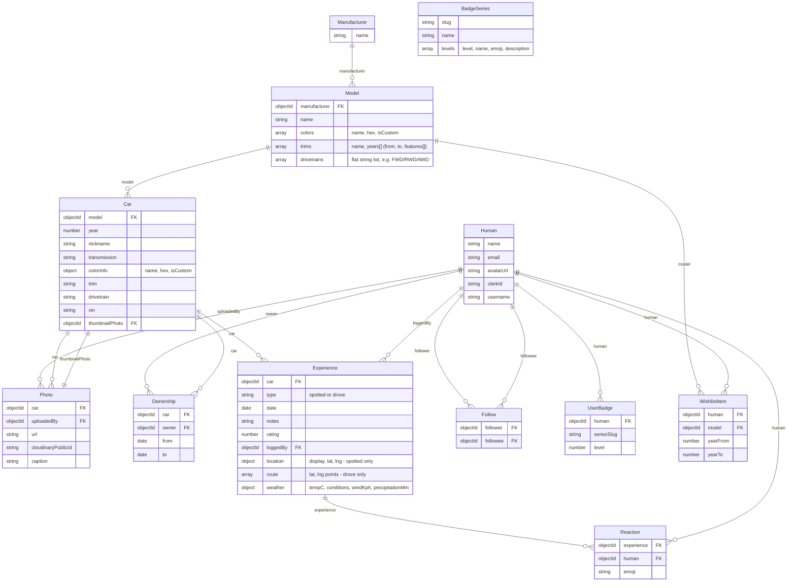

# DB Schema

Reference ER diagram for the schemas defined in [backend/server.js](../dyno-react-app/backend/server.js).

`Model` is its own collection under `Manufacturer` — `Car` and `WishlistItem` reference it by ObjectId rather than matching free-text manufacturer/model strings. Colors and trims live on the `Model` document itself.

## Notes

- API responses still expose `manufacturer`/`model` as display-name strings (populated from the `Model` ref and flattened server-side) — most read paths, including the `/cars/:manufacturer/:model` URL slugs, are name-based and unaffected by the ref underneath.
- Manufacturer selection in car/wishlist forms is dropdown-based, populated from the `Manufacturer`/`Model` registry — there's no free-text manufacturer entry outside the admin "add manufacturer" form, which is the correct place to name a new one.
- `Car.owner` is a legacy field mid-migration to `Ownership` (see `migrateLegacyOwners()` in server.js) — unrelated to the Model work above, still in progress.
- `Experience.loggedBy` is required — every experience must be logged by an authenticated Human (enforced by `requireAuth` on the creating route), so the `Human ||--o{ Experience` edge is a true one-or-many, not optional.
- `Experience.location` and `Experience.route` are mutually exclusive by `type`: `spotted` populates `location` (single point), `drove` populates `route` (path as an array of points). Backend accepts `route` in `POST /api/experiences`; no frontend map/path-drawing UI exists yet.
- `Model.drivetrains` is a flat string list (unlike `trims`, drivetrain doesn't vary by year) — same free-form-fallback validation pattern as trims: a model with no drivetrains registered imposes no constraint on `Car.drivetrain`.
