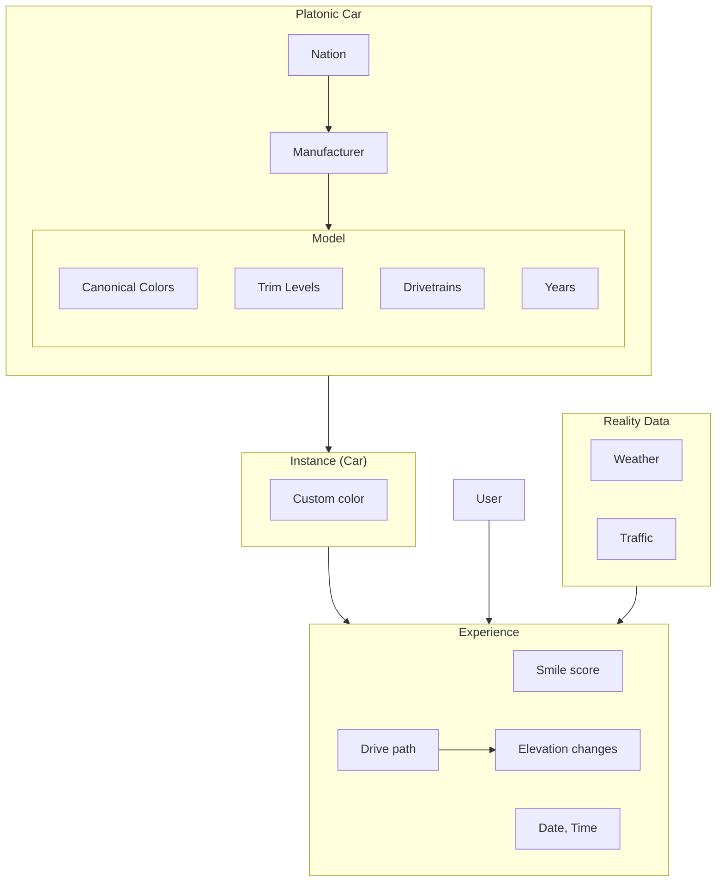

# Product

Dyno is a social car-tracking app. Users log their driving and spotting experiences with cars, react to friends' logs, follow each other, track their garage, earn badges for milestones, and discover community ratings on every car model.

## Core concepts

### Experience

The central unit of activity. An experience is one user's encounter with one specific car, of one of two types:

- **drove** — the user drove the car. Can have a rating (0–5 stars, half-step increments).
- **spotted** — the user saw the car. No rating.

Experiences have optional notes and can collect emoji reactions from other users.

A user "having driven a car" is determined entirely by their drove experiences — there is no separate ownership-implies-driving rule.

### Car

A specific physical car instance: `{year, manufacturer, model, trim?, nickname?, color?, transmission?, vin?}`. Cars are tied to a specific instance, not just a make/model. The same model can have many Car records (e.g. two different 2012 Civics).

Cars have an `ownershipHistory` (a list of who owned the car when) and `currentOwners` (anyone whose ownership has no end date).

### Manufacturer / Model

Manufacturers (Honda, Tesla, etc.) have a `models` array listing valid models. New cars must match an existing manufacturer + model — the API rejects unknown combinations.

Every `{manufacturer, model}` pair has its own model page that aggregates all instances on the platform, community ratings, and wishlist counts.

### Reaction

A user's emoji response (🔥, 👀, 🤙) on someone else's experience. One reaction per (user, experience) — re-acting changes the emoji rather than adding a new one.

### Follow

A directional relationship between two users. Drives the feed: `GET /api/experiences?followedBy=<userId>` returns experiences from the user plus people they follow.

### Wishlist ("Want to drive")

A user's list of cars they'd like to drive, scoped to `{manufacturer, model}` with an optional year range.

- `yearFrom: null, yearTo: null` → any year
- One end null → open-ended on that side
- Both set → bounded range

A drove experience auto-removes any wishlist items the car satisfies. Conversely, the API rejects adding a wishlist entry if the user has already driven a matching car (409 Conflict).

### Badge

A 7-series progressive achievement system. Each series has 3–5 levels triggered by activity thresholds (drives, spots, brand diversity, etc.). Badges are re-evaluated every time a user logs a new experience or follow.

Badge series live in `BadgeSeries`. A user's earned badges live in `UserBadge` with their current `level` per series. When a level-up happens during evaluation, it's returned in the POST experience response as `newBadges`, so the UI can show a celebration.

See `BADGE_DEFS` in [backend/server.js](../dyno-react-app/backend/server.js) for thresholds (counts needed per level) and `BADGE_COUNTERS` for what each series counts.

Visual: badges are rendered as circular icons with a progress ring around the circumference. The ring is divided into `maxLevel` arcs — `level` of them lit in accent color, the rest dim. Locked badges (level 0) have a greyed emoji and an empty ring. The `/badges` page (or `/users/:id/badges`) shows every series with progress bars toward the next level.

## Core flows

### Logging an experience

1. Pick or create a Car
2. Choose drove or spotted, optionally add notes and (for drove) a rating
3. POST `/api/experiences` — server saves the experience, auto-removes matching wishlist items if drove, re-evaluates badges, returns the experience + any new badges
4. UI shows the experience in the feed; if `newBadges` non-empty, shows a celebration

### Reacting

- Tap an emoji on a friend's experience → POST `/api/experiences/:id/reactions` with `{human, emoji}`
- Tap the same emoji again → DELETE `/api/experiences/:id/reactions` to remove

### Following

- POST `/api/follows` with `{follower, followee}` → 409 if already following, 400 if same user
- Feed is filtered to `loggedBy ∈ {currentUser} ∪ following`

### Wishlisting

- POST `/api/wishlist` with `{human, manufacturer, model, yearFrom?, yearTo?}` → 409 if a matching drove experience exists
- DELETE with `{human, manufacturer, model}` to remove
- Driving a car that satisfies a wishlist entry removes it automatically

### Discovering a model

- Click a model name anywhere → `/cars/<mfr-slug>/<model-slug>` (lowercase, hyphenated)
- Page shows: total experiences, community rating, all instances of that model on the platform, recent experiences across all instances, wishlist count, and per-user wishlist/driven state

## Authentication

There is none. The "current user" is found in [src/App.tsx](../dyno-react-app/src/App.tsx) by hardcoded email `sam@samelawrence.com`. Adding real auth is on the Tier 3 roadmap.

## Star rating UI

The custom `StarIcon` component renders a clock-fill star: a bright stroke around the star's outline whose length is proportional to the rating. On hover/tap it expands into a row of 5 mini-stars for picking a value. Geometry details and gotchas in `~/.claude/projects/.../memory/reference_star_icon.md`.
