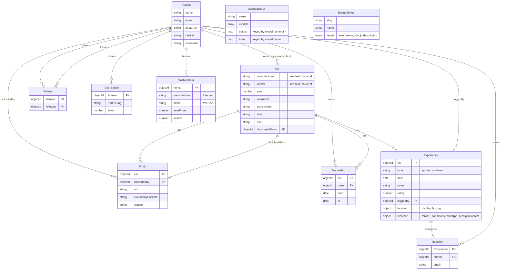
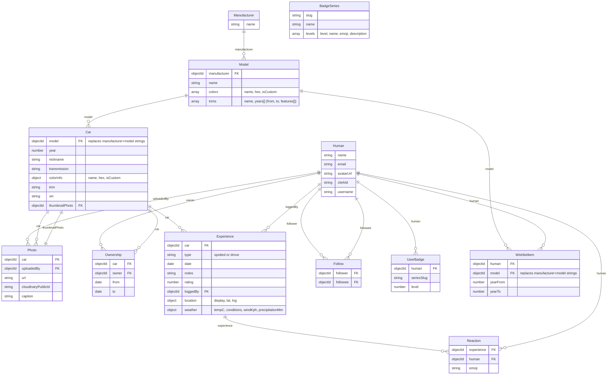

# Proposed DB Schema

Current schema (as of [backend/server.js](../dyno-react-app/backend/server.js)) works but has two denormalization smells:

1. **`Car.manufacturer` / `Car.model` are free-text strings**, not refs. Matching happens via `slugToRegex` case-insensitive regex instead of an index lookup.
2. **`Manufacturer` embeds `models`, `colors`, `trims`** as arrays/maps keyed by model name. A model has no identity of its own — no `_id`, can't be referenced, can't carry its own fields (e.g. a model-level photo) without another map keyed by string.

This doc prototypes both current state and a proposed normalized shape, for discussion — nothing here is implemented.

## Current schema

## Proposed schema

Promote **Model** to its own collection under Manufacturer. `Car` and `WishlistItem` reference `Model` by ObjectId instead of matching manufacturer/model strings. Colors and trims move from Manufacturer-level maps to fields on Model.

### What this fixes

- Model page lookups (`/cars/:mfr/:model`) become an indexed `Model.findOne({ manufacturer, name })` (still slug-matched for the URL, but resolves to one doc, then everything else joins on `Model._id`) instead of regex string matching against every `Car`.
- Model gets identity — can carry its own thumbnail, description, or stats later without inventing another map keyed by string.
- Renaming a model (typo fix, canonicalization) is one doc update instead of a fan-out rewrite across every `Car`/`WishlistItem` string field.

### What it costs

- Every write path that currently sends `manufacturer`/`model` strings (car creation, wishlist creation, the admin manufacturer/model editor) needs to resolve or create the `Model` doc first.
- Migration: existing `Car.manufacturer`/`Car.model` strings need a one-time backfill matching them to (or creating) `Model` docs, then dropping the string fields.
- Frontend slug helpers ([src/lib/modelSlug.ts](../dyno-react-app/src/lib/modelSlug.ts)) still operate on strings for the URL — no change there, just an extra resolution step server-side.

Not decided yet: whether `legacy owner field` (`Car.owner`, already mid-migration to `Ownership`) gets cleaned up in the same pass — separate concern, worth doing before or after but not shown as a diff in the proposed diagram above since it's already underway.
